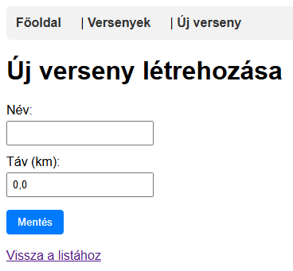

# Futóverseny Kezelő Alkalmazás

# "Futlas"

Spring Boot alapú webalkalmazás, amely futók, versenyek és eredmények kezelését végzi.

## Technológiák
- Java 17
- Spring Boot 3
- Spring Web, Spring Data JPA
- Thymeleaf
- H2 adatbázis
- Maven, Lombok

## Használat
Futtatás után a főmenü elérhető a localhost:8080-on.

### Neptun: S3251Z